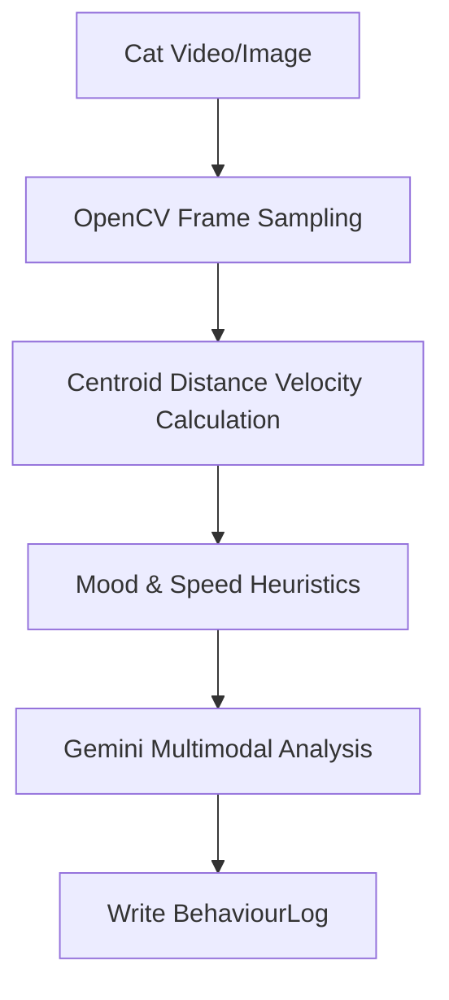

# AI Processing Pipeline

## Pipeline Workflow

## CV Velocity Equations
Velocity is calculated as the centroid coordinates displacement divided by the timestamp delta between frames:
$$V = rac{\sqrt{(x_2 - x_1)^2 + (y_2 - y_1)^2}}{t_2 - t_1}$$
