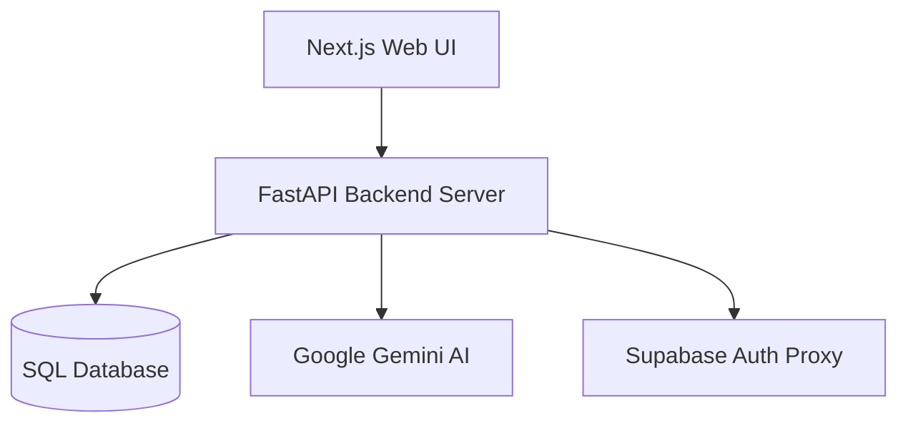

# System Architecture

## Component Structure

## Architectural Design Pattern
- Monorepo containing segregated `frontend/` (Node/React) and `backend/` (FastAPI/Python) services.
- Clean repository-service pattern separating DB queries from business logics.
