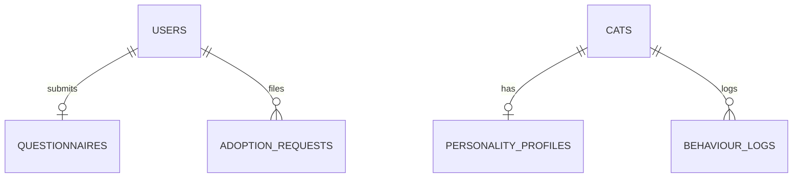

# Database Schema & ERD

## ER Diagram

## Table Specifications
- **`users`**: Primary identifier, email index.
- **`cats`**: Standard name, age, breed, gender parameters.
- **`personality_profiles`**: Linked 1:1 to cat record, holding playfulness, curiosity, energy indexes.
